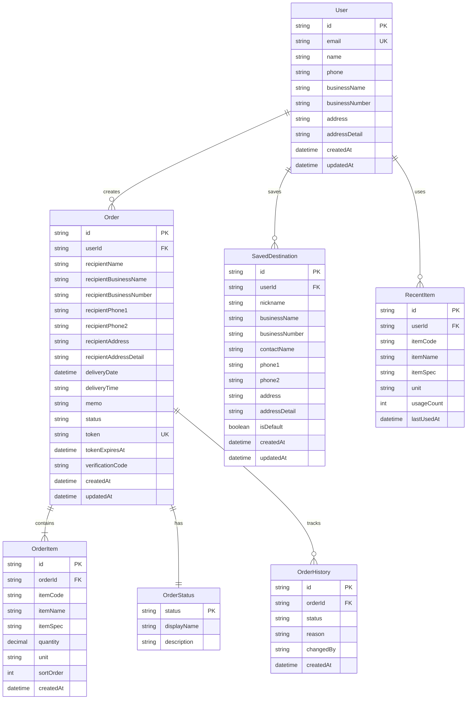

# 데이터베이스 스키마 설계

## ERD (Entity Relationship Diagram)



---

## 테이블 상세 명세

### 1. User (공급자/발주자)

공급자(주문서를 작성하는 사용자) 정보

| 컬럼명 | 타입 | 제약조건 | 설명 |
|--------|------|---------|------|
| id | String (UUID) | PK | 사용자 고유 ID |
| email | String | UNIQUE, NOT NULL | 이메일 주소 (로그인 ID) |
| name | String | NOT NULL | 이름 |
| phone | String | NOT NULL | 핸드폰 번호 |
| businessName | String | NULL | 상호 |
| businessNumber | String | NULL | 사업자번호 (암호화) |
| address | String | NULL | 주소 (기본) |
| addressDetail | String | NULL | 주소 (상세) |
| emailVerified | DateTime | NULL | 이메일 인증 시간 |
| image | String | NULL | 프로필 이미지 URL |
| createdAt | DateTime | DEFAULT NOW | 생성일시 |
| updatedAt | DateTime | AUTO UPDATE | 수정일시 |

**인덱스:**
- `email` (UNIQUE)
- `phone`

---

### 2. Account (소셜 로그인 연동)

NextAuth.js에서 사용하는 OAuth 계정 정보

| 컬럼명 | 타입 | 제약조건 | 설명 |
|--------|------|---------|------|
| id | String (UUID) | PK | 계정 고유 ID |
| userId | String | FK (User) | 사용자 ID |
| type | String | NOT NULL | 계정 타입 (oauth) |
| provider | String | NOT NULL | 제공자 (google, kakao, naver) |
| providerAccountId | String | NOT NULL | 제공자 계정 ID |
| refresh_token | String | NULL | 리프레시 토큰 |
| access_token | String | NULL | 액세스 토큰 |
| expires_at | Int | NULL | 만료 시간 |
| token_type | String | NULL | 토큰 타입 |
| scope | String | NULL | 권한 범위 |
| id_token | String | NULL | ID 토큰 |
| session_state | String | NULL | 세션 상태 |

**인덱스:**
- `(provider, providerAccountId)` (UNIQUE)
- `userId`

---

### 3. Session (세션 관리)

NextAuth.js 세션 정보

| 컬럼명 | 타입 | 제약조건 | 설명 |
|--------|------|---------|------|
| id | String (UUID) | PK | 세션 고유 ID |
| sessionToken | String | UNIQUE, NOT NULL | 세션 토큰 |
| userId | String | FK (User) | 사용자 ID |
| expires | DateTime | NOT NULL | 만료 시간 |

**인덱스:**
- `sessionToken` (UNIQUE)
- `userId`

---

### 4. Order (주문서)

주문서 메인 정보

| 컬럼명 | 타입 | 제약조건 | 설명 |
|--------|------|---------|------|
| id | String (UUID) | PK | 주문서 고유 ID |
| userId | String | FK (User), NOT NULL | 작성자 ID |
| orderNumber | String | UNIQUE, AUTO | 주문 번호 (예: ORD-20250125-0001) |
| recipientName | String | NOT NULL | 수령인 이름 |
| recipientBusinessName | String | NOT NULL | 도착지 상호 |
| recipientBusinessNumber | String | NULL | 도착지 사업자번호 (암호화) |
| recipientPhone1 | String | NOT NULL | 도착지 연락처1 (암호화) |
| recipientPhone2 | String | NULL | 도착지 연락처2 (암호화) |
| recipientAddress | String | NOT NULL | 도착주소 (기본) |
| recipientAddressDetail | String | NULL | 도착주소 (상세) |
| deliveryDate | DateTime | NOT NULL | 도착날짜 |
| deliveryTime | String | NULL | 도착시간 (예: 09:00-12:00) |
| memo | Text | NULL | 비고/메모 |
| status | String | DEFAULT 'DRAFT' | 주문 상태 |
| token | String | UNIQUE, NOT NULL | URL 접근 토큰 (UUID) |
| tokenExpiresAt | DateTime | NOT NULL | 토큰 만료일 (생성일 + 30일) |
| verificationCode | String | NOT NULL | 본인 인증 코드 (핸드폰 뒷자리 4자리, 해시) |
| viewCount | Int | DEFAULT 0 | 조회 수 |
| lastViewedAt | DateTime | NULL | 마지막 조회 시간 |
| createdAt | DateTime | DEFAULT NOW | 생성일시 |
| updatedAt | DateTime | AUTO UPDATE | 수정일시 |

**인덱스:**
- `userId`
- `token` (UNIQUE)
- `orderNumber` (UNIQUE)
- `status`
- `createdAt` (DESC)
- `tokenExpiresAt`

**상태값:**
- `DRAFT`: 작성 중
- `SENT`: 전송됨
- `REJECTED`: 반려
- `REVIEWING`: 검토중
- `ACCEPTED`: 수락
- `COMPLETED`: 완료

---

### 5. OrderItem (주문 품목)

주문서에 포함된 품목 정보

| 컬럼명 | 타입 | 제약조건 | 설명 |
|--------|------|---------|------|
| id | String (UUID) | PK | 품목 고유 ID |
| orderId | String | FK (Order), NOT NULL | 주문서 ID |
| itemCode | String | NULL | 품목코드 |
| itemName | String | NOT NULL | 품목명 |
| itemSpec | String | NULL | 품목규격 |
| quantity | Decimal(10,2) | NOT NULL | 수량 |
| unit | String | NOT NULL | 단위 (박스, kg, ea 등) |
| sortOrder | Int | DEFAULT 0 | 정렬 순서 |
| createdAt | DateTime | DEFAULT NOW | 생성일시 |

**인덱스:**
- `orderId`
- `(orderId, sortOrder)`

---

### 6. OrderHistory (주문 이력)

주문 상태 변경 이력

| 컬럼명 | 타입 | 제약조건 | 설명 |
|--------|------|---------|------|
| id | String (UUID) | PK | 이력 고유 ID |
| orderId | String | FK (Order), NOT NULL | 주문서 ID |
| status | String | NOT NULL | 변경된 상태 |
| reason | Text | NULL | 변경 사유 (반려 시 필수) |
| changedBy | String | NOT NULL | 변경자 구분 (SUPPLIER/RECIPIENT) |
| ipAddress | String | NULL | IP 주소 |
| userAgent | String | NULL | User Agent |
| createdAt | DateTime | DEFAULT NOW | 변경일시 |

**인덱스:**
- `orderId`
- `createdAt` (DESC)

---

### 7. SavedDestination (저장된 도착지)

자주 사용하는 도착지 정보

| 컬럼명 | 타입 | 제약조건 | 설명 |
|--------|------|---------|------|
| id | String (UUID) | PK | 도착지 고유 ID |
| userId | String | FK (User), NOT NULL | 사용자 ID |
| nickname | String | NOT NULL | 별칭 (예: 서울 본사, 부산 지점) |
| businessName | String | NOT NULL | 상호 |
| businessNumber | String | NULL | 사업자번호 (암호화) |
| contactName | String | NOT NULL | 담당자 이름 |
| phone1 | String | NOT NULL | 연락처1 (암호화) |
| phone2 | String | NULL | 연락처2 (암호화) |
| address | String | NOT NULL | 주소 (기본) |
| addressDetail | String | NULL | 주소 (상세) |
| isDefault | Boolean | DEFAULT false | 기본 도착지 여부 |
| usageCount | Int | DEFAULT 0 | 사용 횟수 |
| lastUsedAt | DateTime | NULL | 마지막 사용 시간 |
| createdAt | DateTime | DEFAULT NOW | 생성일시 |
| updatedAt | DateTime | AUTO UPDATE | 수정일시 |

**인덱스:**
- `userId`
- `(userId, isDefault)`
- `(userId, lastUsedAt)` (DESC)

---

### 8. RecentItem (최근 품목)

최근 입력한 품목 정보 (자동완성용)

| 컬럼명 | 타입 | 제약조건 | 설명 |
|--------|------|---------|------|
| id | String (UUID) | PK | 품목 고유 ID |
| userId | String | FK (User), NOT NULL | 사용자 ID |
| itemCode | String | NULL | 품목코드 |
| itemName | String | NOT NULL | 품목명 |
| itemSpec | String | NULL | 품목규격 |
| unit | String | NOT NULL | 단위 |
| usageCount | Int | DEFAULT 1 | 사용 횟수 |
| lastUsedAt | DateTime | DEFAULT NOW | 마지막 사용 시간 |

**인덱스:**
- `userId`
- `(userId, lastUsedAt)` (DESC)
- `(userId, usageCount)` (DESC)

**유니크 제약:**
- `(userId, itemName, itemSpec)` - 같은 품목 중복 방지

---

### 9. Notification (알림)

카카오톡 알림 발송 이력

| 컬럼명 | 타입 | 제약조건 | 설명 |
|--------|------|---------|------|
| id | String (UUID) | PK | 알림 고유 ID |
| orderId | String | FK (Order), NOT NULL | 주문서 ID |
| userId | String | FK (User), NOT NULL | 수신자 ID |
| type | String | NOT NULL | 알림 타입 (STATUS_CHANGED, EXPIRING_SOON) |
| channel | String | NOT NULL | 발송 채널 (KAKAO, EMAIL, SMS) |
| recipient | String | NOT NULL | 수신자 (암호화) |
| title | String | NOT NULL | 알림 제목 |
| message | Text | NOT NULL | 알림 내용 |
| status | String | DEFAULT 'PENDING' | 발송 상태 (PENDING, SENT, FAILED) |
| sentAt | DateTime | NULL | 발송 시간 |
| error | Text | NULL | 에러 메시지 |
| createdAt | DateTime | DEFAULT NOW | 생성일시 |

**인덱스:**
- `orderId`
- `userId`
- `status`
- `createdAt` (DESC)

**상태값:**
- `PENDING`: 발송 대기
- `SENT`: 발송 완료
- `FAILED`: 발송 실패

**알림 타입:**
- `STATUS_CHANGED`: 주문 상태 변경
- `EXPIRING_SOON`: 주문서 만료 임박 (3일 전)
- `ORDER_CREATED`: 주문서 생성

---

## Prisma 스키마 예시

```prisma
// prisma/schema.prisma

generator client {
  provider = "prisma-client-js"
}

datasource db {
  provider = "postgresql"
  url      = env("DATABASE_URL")
}

model User {
  id              String    @id @default(uuid())
  email           String    @unique
  name            String
  phone           String
  businessName    String?
  businessNumber  String?   // 암호화 필요
  address         String?
  addressDetail   String?
  emailVerified   DateTime?
  image           String?
  createdAt       DateTime  @default(now())
  updatedAt       DateTime  @updatedAt

  accounts          Account[]
  sessions          Session[]
  orders            Order[]
  savedDestinations SavedDestination[]
  recentItems       RecentItem[]
  notifications     Notification[]

  @@index([email])
  @@index([phone])
}

model Account {
  id                String  @id @default(uuid())
  userId            String
  type              String
  provider          String
  providerAccountId String
  refresh_token     String? @db.Text
  access_token      String? @db.Text
  expires_at        Int?
  token_type        String?
  scope             String?
  id_token          String? @db.Text
  session_state     String?

  user User @relation(fields: [userId], references: [id], onDelete: Cascade)

  @@unique([provider, providerAccountId])
  @@index([userId])
}

model Session {
  id           String   @id @default(uuid())
  sessionToken String   @unique
  userId       String
  expires      DateTime
  user         User     @relation(fields: [userId], references: [id], onDelete: Cascade)

  @@index([userId])
}

model Order {
  id                       String    @id @default(uuid())
  userId                   String
  orderNumber              String    @unique
  recipientName            String
  recipientBusinessName    String
  recipientBusinessNumber  String?   // 암호화 필요
  recipientPhone1          String    // 암호화 필요
  recipientPhone2          String?   // 암호화 필요
  recipientAddress         String
  recipientAddressDetail   String?
  deliveryDate             DateTime
  deliveryTime             String?
  memo                     String?   @db.Text
  status                   String    @default("DRAFT")
  token                    String    @unique @default(uuid())
  tokenExpiresAt           DateTime
  verificationCode         String    // 해시 저장
  viewCount                Int       @default(0)
  lastViewedAt             DateTime?
  createdAt                DateTime  @default(now())
  updatedAt                DateTime  @updatedAt

  user         User            @relation(fields: [userId], references: [id], onDelete: Cascade)
  items        OrderItem[]
  histories    OrderHistory[]
  notifications Notification[]

  @@index([userId])
  @@index([token])
  @@index([orderNumber])
  @@index([status])
  @@index([createdAt(sort: Desc)])
  @@index([tokenExpiresAt])
}

model OrderItem {
  id        String   @id @default(uuid())
  orderId   String
  itemCode  String?
  itemName  String
  itemSpec  String?
  quantity  Decimal  @db.Decimal(10, 2)
  unit      String
  sortOrder Int      @default(0)
  createdAt DateTime @default(now())

  order Order @relation(fields: [orderId], references: [id], onDelete: Cascade)

  @@index([orderId])
  @@index([orderId, sortOrder])
}

model OrderHistory {
  id         String   @id @default(uuid())
  orderId    String
  status     String
  reason     String?  @db.Text
  changedBy  String   // SUPPLIER or RECIPIENT
  ipAddress  String?
  userAgent  String?  @db.Text
  createdAt  DateTime @default(now())

  order Order @relation(fields: [orderId], references: [id], onDelete: Cascade)

  @@index([orderId])
  @@index([createdAt(sort: Desc)])
}

model SavedDestination {
  id             String    @id @default(uuid())
  userId         String
  nickname       String
  businessName   String
  businessNumber String?   // 암호화 필요
  contactName    String
  phone1         String    // 암호화 필요
  phone2         String?   // 암호화 필요
  address        String
  addressDetail  String?
  isDefault      Boolean   @default(false)
  usageCount     Int       @default(0)
  lastUsedAt     DateTime?
  createdAt      DateTime  @default(now())
  updatedAt      DateTime  @updatedAt

  user User @relation(fields: [userId], references: [id], onDelete: Cascade)

  @@index([userId])
  @@index([userId, isDefault])
  @@index([userId, lastUsedAt(sort: Desc)])
}

model RecentItem {
  id         String   @id @default(uuid())
  userId     String
  itemCode   String?
  itemName   String
  itemSpec   String?
  unit       String
  usageCount Int      @default(1)
  lastUsedAt DateTime @default(now())

  user User @relation(fields: [userId], references: [id], onDelete: Cascade)

  @@unique([userId, itemName, itemSpec])
  @@index([userId])
  @@index([userId, lastUsedAt(sort: Desc)])
  @@index([userId, usageCount(sort: Desc)])
}

model Notification {
  id        String    @id @default(uuid())
  orderId   String
  userId    String
  type      String
  channel   String
  recipient String    // 암호화 필요
  title     String
  message   String    @db.Text
  status    String    @default("PENDING")
  sentAt    DateTime?
  error     String?   @db.Text
  createdAt DateTime  @default(now())

  order Order @relation(fields: [orderId], references: [id], onDelete: Cascade)
  user  User  @relation(fields: [userId], references: [id], onDelete: Cascade)

  @@index([orderId])
  @@index([userId])
  @@index([status])
  @@index([createdAt(sort: Desc)])
}
```

---

## 보안 고려사항

### 암호화 필요 필드
다음 필드는 데이터베이스에 저장 전 암호화 필요:

1. **User 테이블**
   - `businessNumber` (사업자번호)

2. **Order 테이블**
   - `recipientBusinessNumber` (사업자번호)
   - `recipientPhone1`, `recipientPhone2` (연락처)

3. **SavedDestination 테이블**
   - `businessNumber` (사업자번호)
   - `phone1`, `phone2` (연락처)

4. **Notification 테이블**
   - `recipient` (수신자 정보)

### 해싱 필요 필드
- `Order.verificationCode`: 핸드폰 번호 뒷자리 4자리를 bcrypt로 해싱

### 인덱싱 전략
- 자주 조회하는 필드에 인덱스 추가
- 복합 인덱스로 쿼리 성능 최적화
- 너무 많은 인덱스는 INSERT/UPDATE 성능 저하 주의

---

## 마이그레이션 전략

### 초기 마이그레이션
```bash
# 스키마 생성
npx prisma migrate dev --name init

# Prisma Client 생성
npx prisma generate
```

### 데이터 시딩 (개발 환경)
```bash
# 샘플 데이터 생성
npx prisma db seed
```

### 프로덕션 마이그레이션
```bash
# 프로덕션 마이그레이션 (자동 롤백 없음)
npx prisma migrate deploy
```
