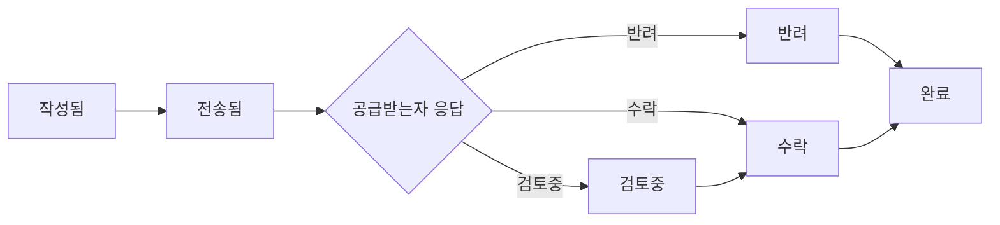

# webOrder - 소상공인·소기업 주문 관리 시스템

## 📋 프로젝트 개요

### 목적
전화 메모나 카카오톡/문자 기반의 비체계적인 주문 관리를 개선하기 위한 웹 기반 주문 관리 시스템

### 핵심 가치
- ✅ 복잡한 로그인 불필요 (공급받는자)
- ✅ 과거 히스토리 및 향후 해야할 일 쉽게 확인
- ✅ 체계적인 주문 관리

### 사용 대상
- **공급자 (발주자)**: 주문서를 작성하고 URL을 전달하는 사용자 - **회원가입 필요**
- **공급받는자 (수주자)**: URL을 받아 주문을 확인하고 상태를 변경하는 사용자 - **회원가입 불필요**

---

## 🔄 사용자 플로우

### 공급자 (발주자) 흐름
```
1. 간편 로그인 (소셜 로그인)
2. 주문서 작성 (여러 품목 입력 가능)
3. 공급받는자 정보 입력 (연락처 포함)
4. 주문서 생성 및 URL 링크 생성
5. URL 링크 공유 (카카오톡 등)
6. 주문 상태 확인 및 히스토리 관리
```

### 공급받는자 (수주자) 흐름
```
1. URL 링크 클릭
2. 본인 인증 (핸드폰 번호 뒷자리 4자리 입력)
3. 주문서 내용 확인
4. 상태 변경 (반려/검토중/수락)
5. (선택) 반려 사유 입력
```

---

## 📊 주문 상태 흐름



**상태 설명:**
- `작성됨`: 공급자가 주문서 작성 중
- `전송됨`: 공급받는자에게 URL 전달됨
- `반려`: 공급받는자가 주문 거부
- `검토중`: 공급받는자가 검토 중
- `수락`: 공급받는자가 주문 수락
- `완료`: 주문 처리 완료

---

## 🔐 보안 정책

### URL 보안
- **유효기간**: 30일 (생성일로부터)
- **접근 제어**: URL만으로 조회 불가
- **본인 인증**: 핸드폰 번호 뒷자리 4자리 입력 필수
- **무단 접근 방지**: 제3자가 URL을 알아도 인증 없이 조회 불가

### 인증 방식
- **공급자**: 소셜 로그인 (Google, Kakao, Naver)
- **공급받는자**: 핸드폰 번호 기반 간단 인증

---

## 📱 알림 기능
- **카카오톡 알림**: 주문 상태 변경 시 공급자에게 알림 전송
- **알림 시점**:
  - 공급받는자가 상태를 변경했을 때
  - 주문서가 곧 만료될 때 (예: 3일 전)

---

## 📦 기능 명세

### 공급자 기능

#### 1. 회원 관리
- 간편 로그인 (소셜 로그인: Google, Kakao, Naver)
- 프로필 관리
  - 로그인 ID (자동 생성)
  - 이메일 주소
  - 핸드폰 번호
  - 상호
  - 이름
  - 주소 (기본/상세)
  - 사업자번호

#### 2. 주문서 작성
- **다품목 입력**: 한 주문서에 여러 품목 입력 가능
- **품목 정보**:
  - 품목코드 (선택)
  - 품목명
  - 품목규격
  - 수량
  - 단위
- **도착지 정보**:
  - 도착지 상호
  - 도착지 사업자번호
  - 도착주소 (기본/상세)
  - 담당자 이름
  - 도착지 연락처1 (필수)
  - 도착지 연락처2 (선택)
  - 도착날짜
  - 도착시간
- **기타**:
  - 주문서 작성일 (자동)
  - 비고/메모

#### 3. 도착지 관리
- 자주 사용하는 도착지 저장 (즐겨찾기)
- 저장된 도착지 목록 조회
- 도착지 선택 시 자동 입력

#### 4. 품목 관리
- 최근 입력한 품목 불러오기
- 품목 자동완성 (최근 사용 기반)

#### 5. 주문서 관리
- 주문서 목록 조회
  - 전체/진행중/완료 필터
  - 날짜별 정렬
  - 상태별 필터
- 주문서 상세 조회
- 주문 상태 히스토리 확인
- URL 링크 복사 및 공유

#### 6. 대시보드
- 진행 중인 주문 현황
- 최근 주문 목록
- 통계 (이번 달 주문 수, 수락률 등)

### 공급받는자 기능

#### 1. 주문서 접근
- URL 링크를 통한 접근
- 본인 인증 (핸드폰 번호 뒷자리 4자리)

#### 2. 주문서 확인
- 주문 상세 내용 조회
- 품목 목록 확인
- 배송 정보 확인

#### 3. 주문 응답
- 상태 변경 (반려/검토중/수락)
- 반려 시 사유 입력 (선택)
- 상태 변경 이력 확인

---

## 💾 데이터 정책

### 데이터 보관
- **활성 주문**: 무제한 보관
- **완료된 주문**: 1년 보관 후 아카이빙
- **만료된 URL**: 30일 후 접근 불가 (데이터는 보관)

### 개인정보 처리
- 사업자번호, 연락처 등 민감정보 암호화
- 최소한의 정보만 수집
- 사용자 동의 기반 정보 수집

---

## 🎯 MVP (Minimum Viable Product) 범위

### Phase 1 - 핵심 기능 (우선 개발)
- ✅ 공급자 회원가입/로그인 (소셜 로그인)
- ✅ 주문서 작성 (다품목)
- ✅ URL 생성 및 공유
- ✅ 공급받는자 주문서 조회 (본인 인증)
- ✅ 상태 변경 (반려/검토중/수락)
- ✅ 주문서 목록 조회

### Phase 2 - 편의 기능
- 도착지 저장 기능
- 최근 품목 불러오기
- 카카오톡 알림
- 대시보드/통계

### Phase 3 - 고급 기능
- 주문서 템플릿
- 엑셀 내보내기
- 일괄 주문서 생성
- 모바일 앱

---

## 📚 관련 문서

- [기술 스택](./TECH_STACK.md)
- [데이터베이스 스키마](./DATABASE_SCHEMA.md)
- [API 명세서](./API_SPEC.md)
- [보안 요구사항](./SECURITY.md)
- [개발 로드맵](./ROADMAP.md)
- [정확도 테스트](./ACCURACY_TEST.md)
